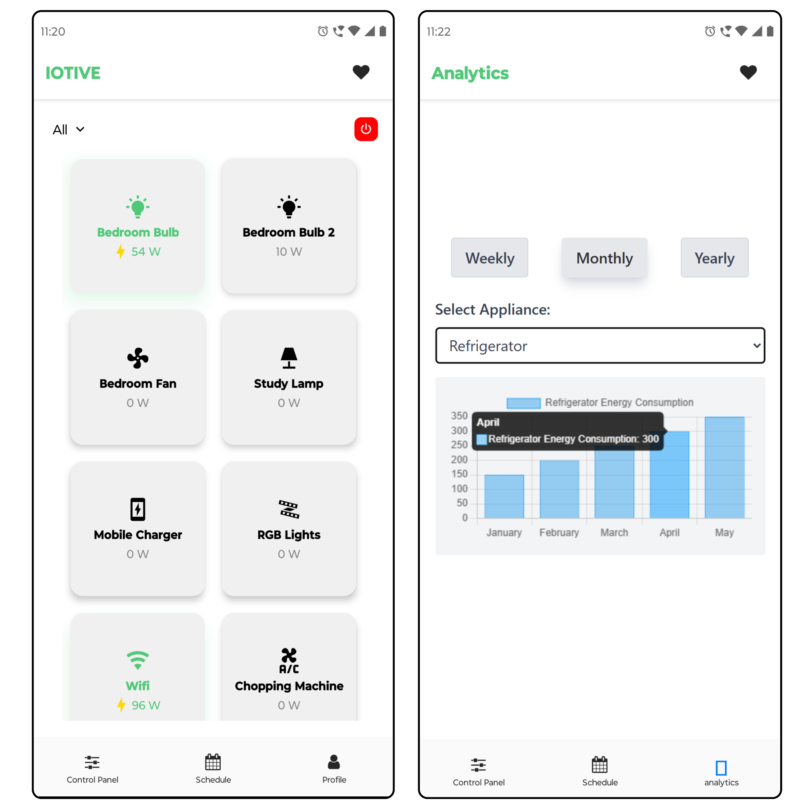
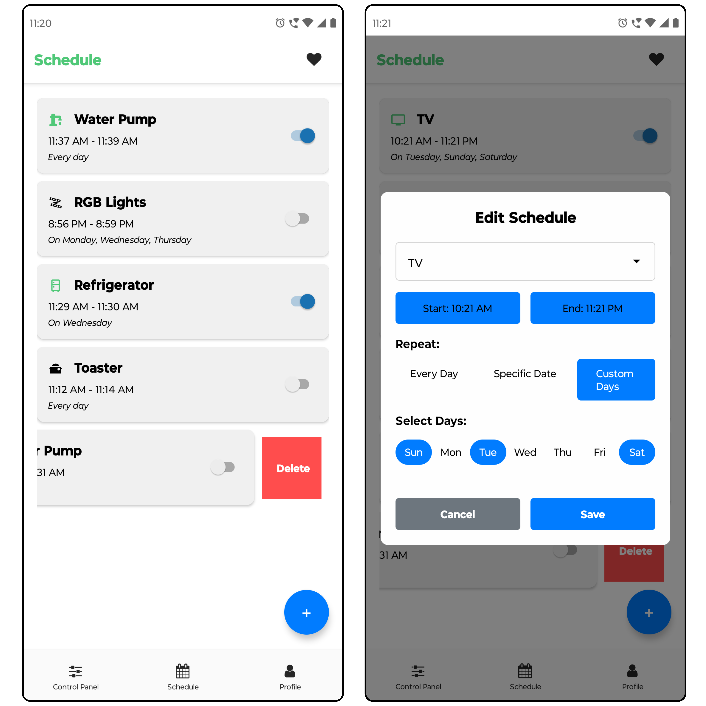

# ⚡ Iotive – Smart Home Appliance Management App

Iotive is a smart home application built to simplify the way users manage their home appliances. It provides real-time control, power usage insights, scheduling, and grouped appliance management, making smart living easy and efficient.

---

## ✨ Features

- 🔐 **User Authentication**
  - Secure login/signup using Firebase Authentication.
  
- 🕹️ **Real-time Appliance Control**
  - Toggle appliances on/off from a centralized control panel using Firebase Realtime Database.
  - Instantly reflects changes with real-time feedback.

- 📊 **Live Power Usage**
  - Monitor live power consumption for each appliance.

- 🧠 **Custom Filters**
  - Group multiple appliances under a single filter.
  - Example: Create a filter named `Study Time` and include fan, study lamp, and PC.
  - Turn all appliances ON/OFF at once or selectively.

- 📅 **Smart Scheduling**
  - Schedule appliances with customizable ON/OFF times.
  - Select specific dates and days (e.g., every Monday, weekends, or daily).

- 📈 **Usage Analytics** *(In Progress)*
  - View usage data through charts and graphs.
  - Track and optimize power consumption per appliance.

---

## 🧪 Tech Stack

- **Frontend:** React Native
- **Backend:** Node.js + Express.js
- **Authentication:** Firebase Authentication
- **Database:**
  - Firebase Firestore (for storing user data, appliance metadata, schedules, etc.)
  - Firebase Realtime Database (for real-time control and sync)

--- 

## 🖼️ Snapshots

### 🔹 App Screen 1 and 2

### 🔹 App Screen 3 and 4

